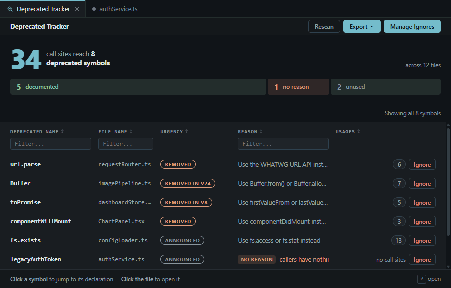

# Deprecated Tracker

> Find and manage deprecated code in your TypeScript and JavaScript projects

[](https://open-vsx.org/extension/milad445/deprecated-tracker) [](https://open-vsx.org/extension/milad445/deprecated-tracker) [](https://www.npmjs.com/package/deprecated-tracker) [](https://www.npmjs.com/package/deprecated-tracker) [](https://github.com/milad-hub/deprecated-tracker/actions/workflows/ci.yml) [](https://opensource.org/licenses/MIT)

### [Scan any public GitHub repository in your browser →](https://milad-hub.github.io/deprecated-tracker/)

Paste `owner/repo`, get the answer, install nothing. The scan runs in the page itself — your browser reads the repository straight from the GitHub API, and nothing is uploaded anywhere. Every result is a shareable link.

Most "find deprecated code" tools grep for `@deprecated` and show you the declarations. This one uses the TypeScript type checker, so it also finds every **usage** of a deprecated symbol — including calls into deprecated APIs from your node_modules dependencies. That's the part you actually need when planning a migration: not "what is deprecated", but "where am I still using it".



Useful when working with large codebases or inherited projects where you need to get a handle on technical debt.

It ships two ways, sharing one scanner:

- **A VS Code extension** — interactive results, a statistics dashboard, editor squiggles and scan history
- **`deprecated-tracker`, an npm CLI** — the same scan headless, for CI, Git hooks and coding agents

## Features

- **Usage tracking** — finds usages of deprecated symbols, not just their declarations
- **Deprecation urgency** — reads `since` and `removed in` out of the text, so what disappears next major sorts above what merely has a high usage count
- **Results and dashboard** — a sortable, filterable table with click-to-jump navigation, plus a trend chart over scan history, hotspot files and quick wins
- **Editor diagnostics** — squiggles on deprecated usages, carrying the deprecation reason
- **Custom tags** — track `@obsolete`, `@legacy`, or your own tags beyond `@deprecated`
- **Ignore management** — hide items per method, per file, or by regex, until you're ready
- **Export** — CSV, JSON, or Markdown, or a ready-to-paste prompt for a coding agent
- **CI ratchet** — a headless CLI that fails a build only when the count *rises* above a committed baseline

## Installation

**Nothing** — [try it on a public repository first](https://milad-hub.github.io/deprecated-tracker/). The page scans a repository's own source; the extension and the CLI also see your dependencies and the TypeScript standard library, and can fail a build.

**The extension** — search for "Deprecated Tracker" in the Extensions view (`Ctrl+Shift+X`), or install [`milad445.deprecated-tracker`](https://marketplace.visualstudio.com/items?itemName=milad445.deprecated-tracker) directly.

**The CLI** — a separate npm package, installed per project rather than bundled with the extension:

```bash
npm install --save-dev deprecated-tracker
```

Neither needs a TypeScript install alongside it; the compiler ships inside both bundles.

**For development**: clone this repo, `npm install`, open in VS Code, and press `F5` to launch the Extension Development Host.

## Usage

Open a TypeScript project (`tsconfig.json`) or JavaScript project (`jsconfig.json`), then press `Ctrl+Shift+P` and run "Deprecated Tracker: Scan Project" — or click **Scan Project** in the sidebar. Right-click any folder or file in the Explorer for "Scan Folder…" / "Scan File…" to cover just that part of the project.

In the results panel, click an item to jump to its location, expand a row to see all usages, filter by name/file/reason, and click any column header to re-sort. Results open most-urgent-first; click **Usages** to switch to the biggest cleanup jobs instead. Scans show a progress notification and can be cancelled mid-run.

### Scan Changes

Click **Scan Changes** in the status bar — or run "Deprecated Tracker: Scan Changes" — to scan only the files git says you have touched, across every repository in the workspace. It answers the daily question a full scan answers slowly: *did the work I am about to commit add deprecated usage?*

The **Scan Changes** section of the settings page controls what counts, per workspace:

- **Staged** and **Unstaged** checkboxes, both on by default. Unstaged also covers untracked files. Clearing both is refused rather than saved.
- **Whole modified files** (default) or **Changed lines only**.

*Changed lines only* is a filter on the results, not a narrower scan — the scanner type-checks whole files either way, so it is not faster, and the notification tells you how many items it hid. Two things it will hide that you probably want to see: adding `@deprecated` to a function puts every call site on an unchanged line, and swapping an import can deprecate a call two hundred lines away that you never touched. That is why whole files is the default.

A changed-files scan is not written to scan history, so it never lands on the dashboard's trend chart. Nothing is scanned on save or on keystroke — this is a scan you ask for.

### The three-way split

Every deprecated declaration is one of three things, and each is a different job. The panel, the browser page and the CLI's summary line all use the same three words:

- **documented** — deprecated, with a reason, and still called. Migrate the call sites; the reason usually names the replacement.
- **no reason** — deprecated with no explanation. Someone has to write one line each, or nobody downstream can act.
- **unused** — deprecated and called nowhere. Safe to delete now, and the cheapest thing on the list.

It counts declarations, not items, so it does not add up to the total — a symbol with forty call sites is one declaration.

### Deprecation Urgency

Deprecation notes often say when something goes away. That text is parsed instead of being kept as opaque prose:

```typescript
/** @deprecated since 2.0, removed in 3.0 */
export function oldApi() {}

/** @deprecated since 2023-01-15, removed 2024-06-30 */
export const oldConstant = 1;
```

Each item gets an urgency, shown in its own column and used as the default sort:

- **Removed** — the removal date has already passed
- **Scheduled** — there's a removal version, or a removal date still in the future
- **Announced** — a `since` marker only, no removal stated

This is what makes the list actionable: a symbol used twice that disappears in the next major outranks one used forty times with no removal date.

Urgency is derived from the deprecation text alone. A removal *version* isn't compared against the declaring package's installed version, so `removed in 3.0` stays **Scheduled** whether or not 3.0 has shipped — only a past ISO date promotes an item to **Removed**.

### Ignoring Items

Sometimes you're aware of deprecated code but not ready to address it. You can:

- **Ignore a specific method/property**: Click "Ignore" next to any item
- **Ignore an entire file**: Click "Ignore File" to hide all items in that file, or right-click the file in the Explorer and choose **Deprecated Tracker: Ignore File**
- **Ignore by pattern**: Add regex patterns for file paths or method names under **Manage Ignores**

Ignored items won't appear in future scans. Click **Manage Ignores** in the results panel to review, remove individual rules, or clear everything at once — it opens in place, with a back button to return to your results.

### Statistics Dashboard

Click **Dashboard** in the sidebar (it appears once you have scan history), or run `Deprecated Tracker: Show Statistics Dashboard`. It reports on your most recent scan:

- **Trend** — deprecated usage count charted across your stored scans, with a dashed baseline at the oldest one and a badge showing the change since then. A drop is styled as a win, because that's the question the dashboard exists to answer: is the number going down?
- Counts by kind (methods, properties, classes, interfaces, functions)
- Top 10 most-used deprecated items and hotspot files
- **Quick wins** — deprecated items with ≤2 usages, easy to clean up first
- **Needs attention** — deprecated declarations with no reason/replacement documented

Rows are clickable and jump straight to the code.

Scan history keeps the last 10 scans, so the trend shows at most 10 points and the baseline is the oldest scan still kept. Once history rolls over, the baseline moves with it.

### Scan History

Every scan is saved automatically (with a cap on stored results per scan). From the sidebar or the results panel history section you can re-open a past scan, export it (CSV/JSON/Markdown), or clear the history. The dashboard's trend chart is built from this history.

### Editor Diagnostics

Deprecated usages are underlined directly in the editor, with the deprecation reason in the hover message. The squiggle level follows the `severity` config option (`info`, `warning`, or `error`).

Each squiggle also carries the declaration it came from. The Problems panel and the hover show it as a link, and **Quick Fix** (`Ctrl+.` / `Cmd+.`) on the usage offers **Go to declaration**, naming the file and line it will jump to. Nothing is rewritten — the action only navigates.

### Custom Deprecation Tags

Beyond `@deprecated`, you can define custom tags:

1. Run `Deprecated Tracker: Open Settings` (or click **Settings** in the sidebar)
2. Add your tags:
   - **Tag Name**: e.g., `@obsolete`, `@legacy`, `@experimental` (must start with `@`)
   - **Label**: Display name
   - **Description**: What it means — also used as the fallback deprecation reason when the code comment doesn't provide one
   - **Color**: For visual distinction
3. Enable/disable as needed

**Pre-configured tags:**

- `@obsolete` - Outdated code that should be replaced
- `@legacy` - Old code kept for compatibility
- `@experimental` - Unstable features (disabled by default)

**Example usage in your code:**

```typescript
/**
 * @obsolete Use the new PaymentServiceV2 instead
 */
export class PaymentService {
  // ...
}

/**
 * @legacy Kept for backward compatibility only
 * @param oldFormat The legacy format
 */
function processLegacyData(oldFormat: string) {
  // ...
}
```

**Note:** Custom tags are validated — they can't conflict with reserved JSDoc tags like `@param`, `@returns`, or `@deprecated` itself.

### Exporting Results

**Export ▼** in the results panel offers four things:

- **CSV** for spreadsheets, with `Urgency`, `Since` and `Removal` columns
- **JSON** for CI/CD or programmatic use, carrying the full parsed deprecation schedule
- **Markdown** for documentation, with `Urgency` and `Removal` columns
- **Copy prompt for AI fix** — a modal instead of a save dialog, covered below

All four export the rows the panel is showing, so column filters apply. To export the whole workspace regardless of filters, use **Deprecated Tracker: Export Results** from the palette, or the CLI: `deprecated-tracker --format json`. Historical scans have their own Export button in the history list.

### Copy prompt for AI fix

The extension already knows what an agent would otherwise have to rediscover: which symbols are deprecated, where each is declared, every call site, what the deprecation note says, and which ones are already past their removal date. **Copy prompt for AI fix** hands that over as a brief.

- Covers exactly the rows the panel is showing, so a filtered view produces a prompt for that subset. Usages are grouped under their file, paths are workspace-relative, and symbols are ordered by urgency — a compact prompt costs less to run.
- The work list is capped; when it truncates, the prompt says how many symbols it covers out of the total, so nothing is silently dropped.
- **Copy** puts it on the clipboard; **Save as .txt** writes it to a file if you'd rather hand the agent a path.
- No source snippets and no guessed replacements. The extension never edits code and never calls a model — the feature ends at text on your clipboard.

## Configuration

You can customize scanner behavior by creating a `.deprecatedtrackerrc` file or adding a `deprecatedTracker` section to your `package.json`. Changes are picked up automatically — the extension watches both files, so the next scan uses the new config without reloading the window.

Create a `.deprecatedtrackerrc` file in your project root — or put the same object under a `deprecatedTracker` key in `package.json`:

```json
{
  "trustedPackages": ["rxjs", "lodash", "@angular/core", "my-internal-lib"],
  "excludePatterns": ["**/*.spec.ts", "**/*.test.ts", "**/test/**"],
  "includePatterns": ["src/**/*.ts"],
  "severity": "warning"
}
```

### Whose rules apply

By default the configuration is read from the project being scanned, which is the right thing on a
developer's machine and the wrong thing in CI: on a fork's pull request, that file is written by the
same person as the code. Two flags move that decision to the operator.

```bash
deprecated-tracker . --config ci/deprecated-tracker.json   # rules from outside the tree
deprecated-tracker . --no-project-config                   # built-in defaults, nothing else
```

Every run prints which file its rules came from and what they allowed, so a `0 item(s)` report can
be told apart from a suppressed one. A `--config` path that cannot be read fails the run instead of
falling back to the defaults.

### Available Options

- **suppressPackages** (or **trustedPackages**, the older name): npm packages whose deprecated APIs are not reported. When specified, it replaces the defaults; use an empty array to report every package. A scope entry like `@angular` covers every `@angular/*` package. Both keys are read and merged, so either name works. Whenever the list actually hides something, the report says how much and from which package — a suppressed zero is not a clean one.
- **excludePatterns**: Glob patterns for files to exclude from scanning (e.g., `**/*.test.ts`). This is also how the CLI ignores whole files — there is no separate file-ignore key.
- **includePatterns**: Glob patterns for files to include (when specified, only these files are scanned)
- **severity**: `'info'`, `'warning'`, or `'error'` — sets the severity of reported items and the editor squiggle level
- **customTags**: `[{ "tag": "@legacy", "description": "…" }]` — tags beyond `@deprecated` to treat as deprecation markers. Reserved JSDoc tags (`@param`, `@returns`, …) are refused, and a bad entry is warned about and skipped rather than failing the run.
- **ignoreMethods**: Regex sources (e.g. `["^legacy[A-Z]"]`) for method names to leave unreported. Matched against the bare name in **every** file, so keep them specific.

`customTags` and `ignoreMethods` exist because the editor keeps its own tags and ignore rules in VS Code workspace storage, which nothing headless can read. Configure them here and the CLI honours them too.

Deprecation tags are only ever read from real JSDoc (`/** ... */`) comments. A `@deprecated` written in a `//` or plain `/* */` comment is never reported.

### Configuration Priority

1. `.deprecatedtrackerrc` (if exists)
2. `package.json` with `deprecatedTracker` key (if exists)
3. Default configuration (if no config files)

In a multi-root workspace the folders are checked in order and the first one that defines a configuration applies to the whole workspace. Every folder's config files are watched, and folders added or removed after startup are picked up automatically.

## CI, Git hooks and coding agents

The **[`deprecated-tracker`](https://www.npmjs.com/package/deprecated-tracker) npm
package** is the same scanner without the editor — `npm install --save-dev
deprecated-tracker`. It records today's deprecation count as a **baseline** and
fails a build only when the number *rises*, so debt becomes something a team
ratchets down instead of a wall it can never clear. The extension does not
install it; the two are used independently.

```bash
npx deprecated-tracker --update-baseline   # commit the baseline file
npx deprecated-tracker .                   # exits 1 only if the count went up
npx deprecated-tracker --staged            # gate a commit from a pre-commit hook
npx deprecated-tracker --changed           # everything uncommitted, for pre-push
npx deprecated-tracker --format markdown   # a report to paste into a PR
```

### Let Claude Code and Codex call it

One command registers the scanner as an MCP server, so the agent gets
`scan_project`, `scan_changes` and `scan_files` as named tools — schemas it can
read, structured results instead of parsed stdout, and no shell-approval prompt
per call.

```bash
# Just you, every project you open
npx deprecated-tracker mcp install --agent claude-code --scope user
npx deprecated-tracker mcp install --agent codex --scope user

# The whole team, committed with the repo — run it from inside the repo
npx deprecated-tracker mcp install --agent claude-code --scope project
npx deprecated-tracker mcp install --agent codex --scope project

npx deprecated-tracker mcp install --agent all --scope project   # both at once
npx deprecated-tracker mcp uninstall --agent all --scope user    # same flags to undo
```

**`--scope user`** registers it once for every project you open — the entry goes
in your home directory (`~/.claude.json`, `~/.codex/config.toml`).

**`--scope project`** is the default and registers it for **the directory you
run the command in** — `.mcp.json` at the repo root for Claude Code,
`.codex/config.toml` for Codex. Both are meant to be committed, so a teammate
has the tool straight after a clone. Run it from inside the repo: from a home
folder it registers a "project" no agent will ever open. The CLI names the
directory it used and warns if that directory is not a git repository.

Afterwards: **restart the agent**, and if you chose project scope, Claude Code
asks you to approve the server the first time it sees it (`/mcp` if you miss the
prompt).

**[Full CLI reference →](docs/CLI.md)** — every option and exit code, SARIF and
GitHub/Azure annotations, hook recipes for husky, lint-staged, lefthook,
simple-git-hooks and pre-commit, and where each registration is written.

## Requirements

- VS Code 1.74.0 or newer
- A trusted workspace (VS Code restricts the extension in an untrusted one)
- A TypeScript project with `tsconfig.json` **or** a JavaScript project with `jsconfig.json` anywhere in the workspace (nested projects are discovered automatically)
- Scans `.ts`, `.tsx`, `.js` and `.jsx` files

That's it! Nothing to install alongside it — the TypeScript compiler ships inside the extension. Works with any TypeScript or JavaScript project, regardless of framework.

The extension checks all of this itself. When you open the Deprecated Tracker view or run a scan, anything that would stop that scan from working opens a **Requirements** page listing every check, what is wrong, and how to fix it — including a button to create a starter `tsconfig.json`. It stays out of your way until then: opening an unrelated project never raises it. Run `Deprecated Tracker: Check Requirements` any time to see the same list when everything is fine.

## How It Works

1. Reads your `tsconfig.json` or `jsconfig.json` (following project references), builds a TypeScript program, and walks the AST of every project file
2. Detects deprecation markers: `@deprecated` JSDoc tags, your enabled custom tags, and `@deprecated()`-style decorators
3. Uses the type checker to resolve every identifier, call, and property access back to its declaration — so usages are found wherever they are, including in imported packages
4. Parses the deprecation text for `since` and `removed in` markers to rank each item by urgency

Scanning respects your TypeScript/JavaScript configuration, so it only looks at files that are actually part of your project.

## Development

```bash
npm install
npm run dev           # tsc watch mode
npm run build         # compile + bundle extension and CLI + copy webview assets
npm run build-package # build, then package both the VSIX and the npm tarball
npm test              # run tests (npm run test:coverage for the 100% thresholds)
```

Node 18+ and npm 9+. Press `F5` in VS Code to launch the extension in a debug window.

## Contributing

Found a bug? Have an idea? Issues and pull requests are welcome.

## License

MIT License - feel free to use this however you want.
